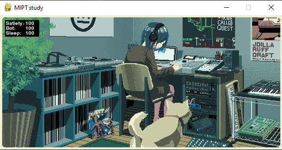
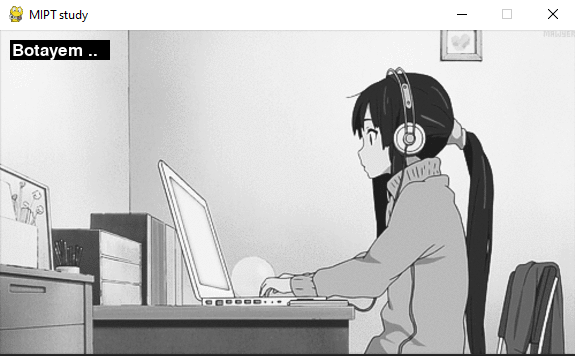
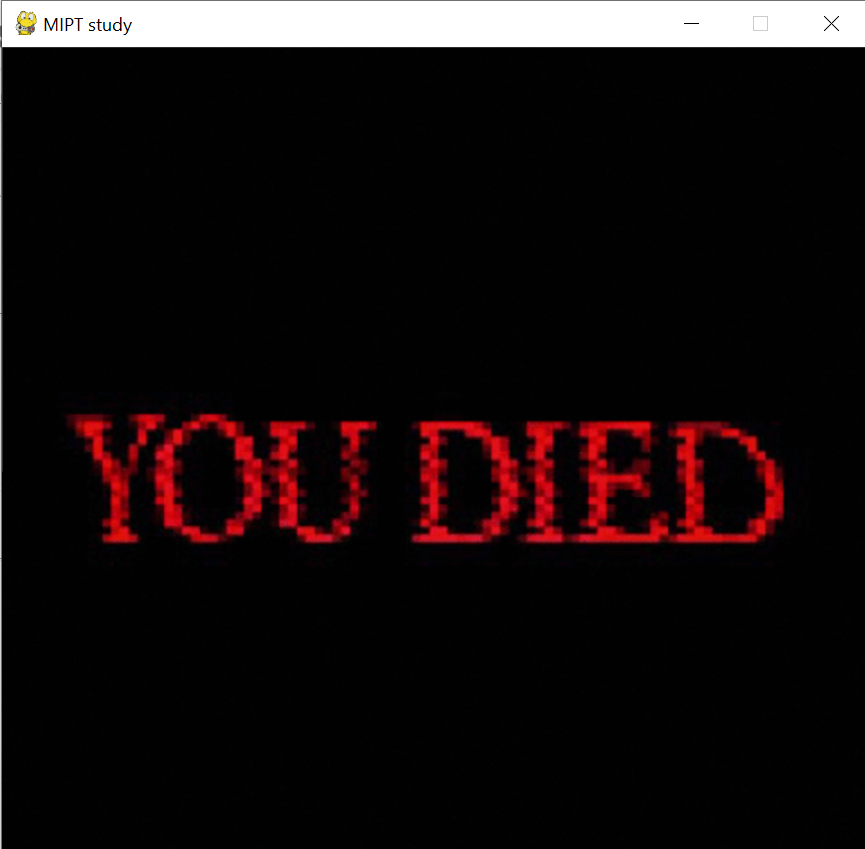

# Tamagochi MIPT student #

## Как играть? ##

+ У вас есть MIPT student, ваша задача не дать ему умереть пока он учится
+ Вы можете:
    + Кормить его нажав на клавишу F(Feed)
    + Спать - S(Sleep)
    + Ботать - B(Bot)

+ Если ваши показатели опустятся до нуля, то у вас все равно будет шанс все
  исправить

## Как запустить? ##

<code>git clone https://github.com/Sigbln/Tamagochi.git</code>

<code>cd Tamagochi</code>

<code>python main.py</code>

## Screens ##

