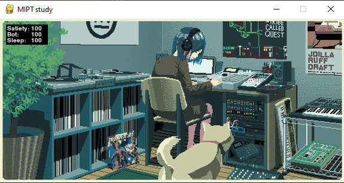
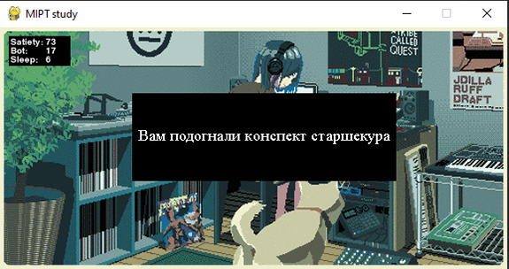
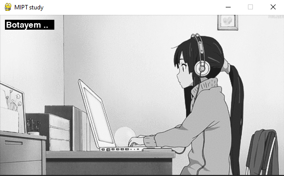
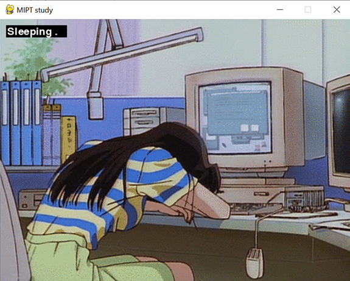
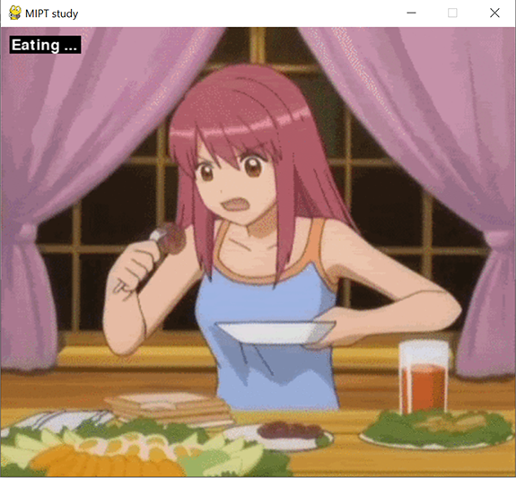

# Tamagochi MIPT student #

## Как играть? ##

+ У вас есть MIPT student, ваша задача не дать ему умереть пока он учится
+ Вы можете:
    + Кормить его нажав на клавишу F(Feed)
    + Спать - S(Sleep)
    + Ботать - B(Bot)

+ Если ваши показатели опустятся до нуля, то у вас все равно будет шанс все
  исправить

+ Так же может произойти случайное событие, в зависимости от которого будут
  изменены ваши показатели

## Как запустить? ##

```
git clone https://github.com/Sigbln/Tamagochi.git
cd Tamagochi
python main.py
```

## Screens ##






